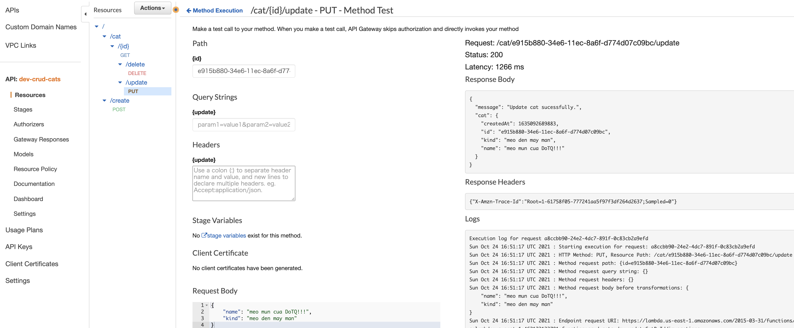
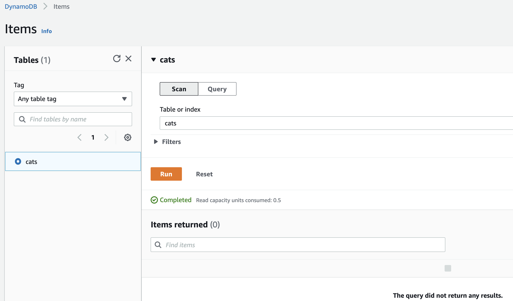
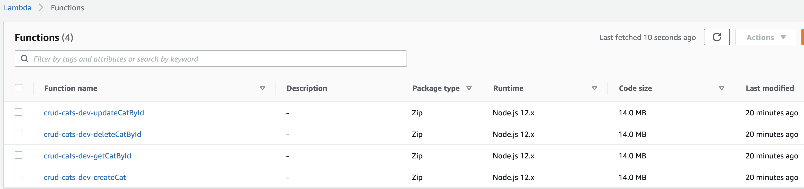

# aws-node-serverless-lambda-api-gw-dynamodb 🐳


[](https://github.com/tquangdo/aws-node-serverless-lambda-api-gw-dynamodb/issues/new)

## reference
[trungquandev](https://trungquandev.com/viet-mot-crud-api-su-dung-serverless-framework-dynamodb/)

## aws deploy
1. settting printenv
```shell
export AWS_ACCESS_KEY_ID=<your-key-here>
export AWS_SECRET_ACCESS_KEY=<your-secret-key-here>
printenv | grep AWS
```
2. `sls deploy`
3. =>
```yml
Serverless: Packaging service...
Serverless: Excluding development dependencies...
Serverless: Uploading CloudFormation file to S3...
Serverless: Uploading artifacts...
Serverless: Uploading service crud-cats.zip file to S3 (14.68 MB)...
Serverless: Validating template...
Serverless: Updating Stack...
Serverless: Checking Stack update progress...
........................................................
Serverless: Stack update finished...
Service Information
service: crud-cats
stage: dev
region: us-east-1
stack: crud-cats-dev
resources: 30
api keys:
  None
endpoints:
  POST - https://<endpoint>/dev/create
  GET - https://<endpoint>/dev/cat/{id}
  PUT - https://<endpoint>/dev/cat/{id}/update
  DELETE - https://<endpoint>/dev/cat/{id}/delete
functions:
  createCat: crud-cats-dev-createCat
  getCatById: crud-cats-dev-getCatById
  updateCatById: crud-cats-dev-updateCatById
  deleteCatById: crud-cats-dev-deleteCatById
layers:
  None
```

## screenshots



